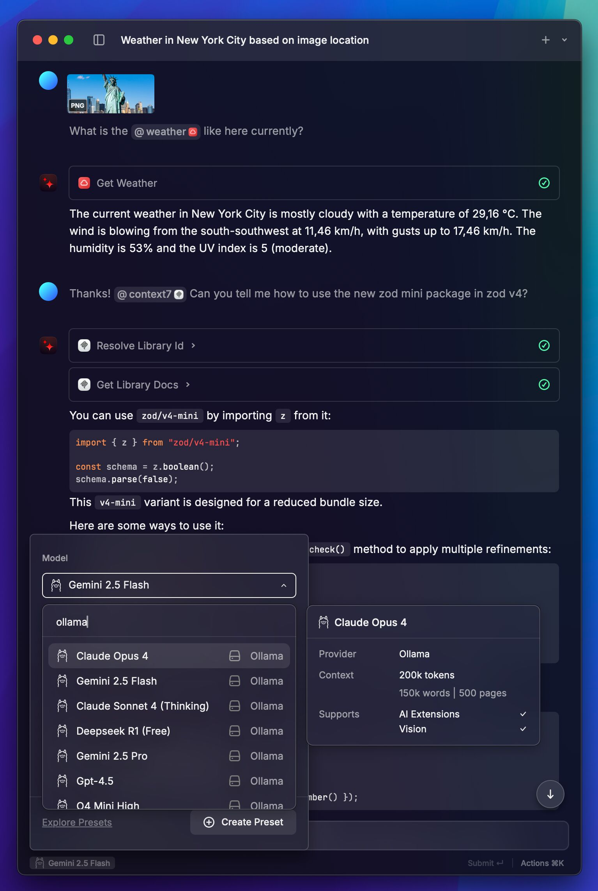
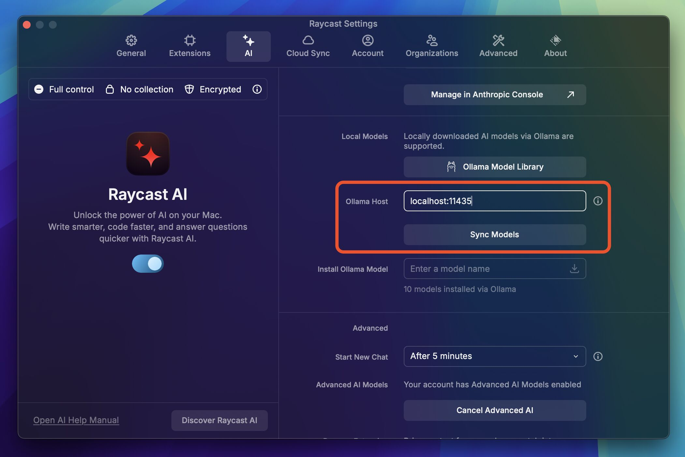

# Raycast AI OpenRouter Proxy

This project provides a proxy server that allows Raycast AI to utilize models from any OpenAI-compatible API (OpenAI, Gemini, OpenRouter, etc.). This brings "Bring Your Own Key" (BYOK) functionality to Raycast AI, meaning you can use your own API key and models from your chosen provider. By default, the proxy is configured to use OpenRouter.

**No Raycast Pro subscription required!** 🎉

This proxy allows using custom models inside Raycast, including **AI Chat**, **AI Commands**, **Quick AI**, and **AI Presets**, giving you Raycast's native AI experience with the flexibility of custom models and your own API key.

> [!WARNING]
>
> **Work In Progress**: This project is still in development. While it works well for many use cases, there may be bugs and possible issues. Use with caution.



## Features

This proxy aims to provide a seamless experience for using custom models within Raycast. Here's what is supported and what is not:

### Supported:

- 🧠 **Any model**: Access the wide range of models offered by OpenAI-compatible providers. OpenRouter is used by default.
- 👀 **Vision support**: Use models capable of processing images.
- 🛠️ **AI Extensions & MCP**: Use your favorite AI Extensions and MCP servers. Note that Ollama tool calling support is experimental in Raycast.
- 📝 **System instructions**: Provide system-level prompts to guide model behavior.
- 📎 **Attachments**: Attach all the same things as with the official models.
- 🔨 **Parallel tool use**: Make multiple tool calls simultaneously.
- ⚡ **Streaming**: Get real-time responses from models.
- 🔤 **Chat title generation**: Automatically generate chat titles.
- 🛑 **Stream cancellation**: Stop ongoing responses from models.

### Not Supported:

- 💭 **Displaying thinking process**: Models do not display their thinking process, but thinking models are supported.
- 🌐 **Remote tools**: Some AI Extensions are classified as "remote tools" and are not supported. These include web search and image generation, as well as some others. You can replace these with MCP servers if you would like similar tools.

## Requirements

- Docker
- API key for your chosen provider (e.g., OpenRouter)

## Getting Started

To get started, follow these steps:

1. Clone the repository:

   ```bash
   git clone https://github.com/miikkaylisiurunen/raycast-ai-openrouter-proxy.git
   ```

2. Change into the project directory:

   ```bash
   cd raycast-ai-openrouter-proxy
   ```

3. Configure your provider in the Docker Compose file. Open the `docker-compose.yml` file and replace `YOUR_API_KEY` with your API key. By default, the proxy uses OpenRouter. To use a different OpenAI-compatible provider, change the `BASE_URL` to your provider's API endpoint.

4. Update the models configuration file. An example `models.json` file is included in the project root for configuring models. Refer to the [Configuration](#configuration) section for details on its structure.

5. Start the proxy server:

   ```bash
   docker compose up -d --build
   ```

   This will start the proxy server in the background. By default, it will run on port `11435`. If that port is already in use, you can change it in the `docker-compose.yml` file.

6. Set the Ollama host in Raycast settings: Open Raycast Settings, go to AI > Ollama Host and set the host to `localhost:11435`. If you changed the port in the `docker-compose.yml` file, make sure to update it here as well. You can also enable experimental AI Extension and MCP support in the Raycast settings. See the [Configuration](#configuration) section for more details.

   

## Configuration

The proxy's behavior is primarily configured through a `models.json` file in the root directory of the project. This file defines the models available to Raycast and their specific settings. An example `models.json` file is included in this repository. Each entry in the JSON array represents a model and can include the following properties:

- `name`: The name of the model as it will appear in Raycast.
- `id`: The model ID in the format expected by your provider.
- `contextLength`: The maximum context length (in tokens) the model supports. Only affects Raycast's UI and not the model itself.
- `capabilities`: An array of strings indicating the model's capabilities.
  - `"vision"`: The model can process images.
  - `"tools"`: The model supports AI Extensions and MCP (tool calling). You need to enable the experimental AI Extensions for Ollama Models in Raycast settings for this to work. This can be found at the bottom of the AI settings in Raycast.
- `temperature`: (Optional) Controls the creativity of the model. A value between 0 and 2.
- `topP`: (Optional) Another parameter to control the randomness of the output, a value between 0 and 1.
- `max_tokens`: (Optional) The maximum number of tokens the model is allowed to generate in a single response.
- `extra`: (Optional) An object for advanced, provider-specific configurations. These options are passed directly to the provider's API. For example, you can use it for OpenRouter-specific settings like specifying a preferred provider (`"provider": { "only": ["openai"] }`) or setting the reasoning effort for supported models (`"reasoning": { "effort": "high" }`). Refer to your provider's documentation for available parameters. Note that `extra` properties are not validated at startup. If you encounter issues, check the container logs after sending a request for any errors related to these settings.

When you modify the `models.json` file, you need to restart the proxy server for the changes to take effect. You can do this by running:

```bash
docker compose restart
```

Example `models.json` structure for OpenRouter:

```json
[
  {
    "name": "Gemini 2.5 Flash",
    "id": "google/gemini-2.5-flash",
    "contextLength": 1000000,
    "capabilities": ["vision", "tools"],
    "temperature": 0
  },
  {
    "name": "Gemini 2.5 Flash Thinking",
    "id": "google/gemini-2.5-flash:thinking",
    "contextLength": 1000000,
    "capabilities": ["vision", "tools"],
    "temperature": 1
  },
  {
    "name": "GPT-4o Mini",
    "id": "openai/gpt-4o-mini",
    "contextLength": 128000,
    "capabilities": ["vision", "tools"]
  },
  {
    "name": "Claude Sonnet 4 (Thinking)",
    "id": "anthropic/claude-sonnet-4",
    "contextLength": 200000,
    "capabilities": ["vision", "tools"],
    "extra": {
      "reasoning": {
        "max_tokens": 4000
      }
    }
  }
]
```

## FAQ

### How does this compare to the official Raycast BYOK feature?

Raycast released a built-in BYOK feature in v1.100.0. The official implementation has a few differences compared to this proxy:

- It only supports Anthropic, Google and OpenAI. This proxy supports any OpenAI-compatible provider.
- All your messages go through Raycast's servers.
- Your API keys are sent to Raycast's servers.
- You have less control over the models and their configurations.

### What works/does not work?

Refer to the [Features](#features) section for a list of supported and unsupported functionalities.

### Is a Raycast Pro subscription required to use this?

No, one of the main benefits of this proxy is to enable the use of custom models within Raycast without needing a Raycast Pro subscription.

### Can I deploy this on a remote server?

Yes, but it is generally not recommended. There is currently no authentication implemented, meaning anyone with access to your server's address could potentially make requests using your API key. You would need to implement your own authentication mechanism if you want to secure it for remote access.

### Do I need to install Ollama?

No, you do not need to install Ollama.

### How do I configure Raycast to use this proxy?

See the [Getting Started](#getting-started) section.

### How does this work?

This proxy acts as an Ollama server, allowing Raycast to communicate with it. It translates requests from Raycast into a format that the target OpenAI-compatible API understands.

### I updated the model configuration, but it doesn't seem to take effect. What should I do?

If you modify the `models.json` file, you need to restart the proxy server for the changes to take effect. You can do this by running:

```bash
docker compose restart
```

### What if something doesn't work?

If you encounter issues, a good first step is to check the container logs. You can do this by running the command:

```bash
docker compose logs
```
